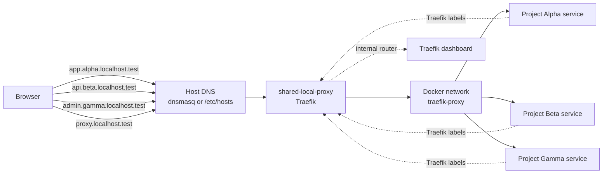

# Local Proxy

One shared local reverse proxy for all your projects.

`local-proxy` solves the usual local-routing sprawl: duplicate Traefik containers, competing port `80` bindings, inconsistent local domains, and per-project proxy setup that every team has to rediscover.

## Why this exists

Without a shared local proxy, teams usually end up with some combination of these problems:

- each repository owns its own reverse proxy
- multiple proxies compete for port `80`
- local domains differ from project to project
- `/etc/hosts` gets noisy and hard to maintain
- onboarding depends on project-specific tribal knowledge
- debugging local routing is fragmented across repos

This repository centralizes that concern into one machine-level layer.

## What you get

- one shared reverse proxy for the whole machine
- one shared Docker network: `traefik-proxy`
- one consistent domain model for every local project
- one dashboard domain: `http://proxy.localhost.test`
- one place to manage boot-time startup
- one optional Ansible bootstrap path for team onboarding

## Quickstart

### 1. Configure host DNS

Wildcard local domains are a host-level dependency.

`dnsmasq` is **not** part of the Docker Compose stack because your browser and operating system must resolve domains such as `app.project.localhost.test` before traffic ever reaches Docker.

Preferred wildcard rule:

```conf
address=/.localhost.test/127.0.0.1
```

macOS:

```bash
cd ~/projects/infra/local-proxy
./scripts/setup-macos-dnsmasq.sh
```

Linux:

```bash
cd ~/projects/infra/local-proxy
./scripts/setup-linux-dnsmasq.sh
```

If you do not configure `dnsmasq`, use explicit `/etc/hosts` entries instead.

### 2. Start the shared proxy

```bash
cd ~/projects/infra/local-proxy
docker compose up -d
```

### 3. Verify

```bash
docker ps --filter name=shared-local-proxy --format 'table {{.Names}}\t{{.Status}}\t{{.Ports}}'
```

Open:

- `http://proxy.localhost.test`

## How it works

Projects should not run their own Traefik container.

Each project should only:

1. join the external Docker network `traefik-proxy`
2. expose Traefik labels on its services
3. choose domains such as `app.<project>.localhost.test`

That keeps local routing infrastructure centralized while individual repos stay focused on the application.



## Canonical names

- container: `shared-local-proxy`
- network: `traefik-proxy`
- dashboard domain: `proxy.localhost.test`

## Prerequisites

- Docker Desktop or a running Docker daemon
- permission to bind to port `80`
- host DNS configured for `*.localhost.test`, or explicit `/etc/hosts` entries

## Recommended install path

Clone this repository anywhere you keep shared local infrastructure. Example:

```bash
git clone <your-org-or-user>/local-proxy.git ~/projects/infra/local-proxy
```

All examples in this README assume:

```text
~/projects/infra/local-proxy
```

## Repository layout

- `docker-compose.yml` - shared Traefik stack
- `dnsmasq/localhost.test.conf` - wildcard DNS example
- `scripts/setup-macos-dnsmasq.sh` - configure host DNS on macOS
- `scripts/setup-linux-dnsmasq.sh` - configure host DNS on Linux
- `install-macos-launchd.sh` - install boot-time startup on macOS
- `install-linux-systemd.sh` - install boot-time startup on Linux
- `launchd/com.shared-local-proxy.plist` - macOS launch agent template
- `systemd/shared-local-proxy.service` - Linux systemd user unit template
- `ansible/` - optional facilitator layer for repeatable machine bootstrap

## Facilitated setup with Ansible

Use Ansible if you want a repeatable machine bootstrap instead of running the setup scripts manually.

See:

- `ansible/README.md`

macOS:

```bash
cd ~/projects/infra/local-proxy/ansible
ansible-playbook -i inventory/localhost.ini bootstrap-macos.yml
```

Linux:

```bash
cd ~/projects/infra/local-proxy/ansible
ansible-playbook -i inventory/localhost.ini bootstrap-linux.yml
```

The Ansible layer handles:

- host-level `dnsmasq` setup
- boot-time service installation
- starting the shared proxy stack

## How projects integrate

Example Compose snippet:

```yaml
services:
  app:
    labels:
      - traefik.enable=true
      - traefik.http.routers.myproject-app.rule=Host(`app.myproject.localhost.test`)
      - traefik.http.services.myproject-app.loadbalancer.server.port=3000
    networks:
      - traefik-proxy

networks:
  traefik-proxy:
    external: true
```

## Boot-time startup

macOS:

```bash
cd ~/projects/infra/local-proxy
./install-macos-launchd.sh
```

Linux:

```bash
cd ~/projects/infra/local-proxy
./install-linux-systemd.sh
```

If you use a different local path, update the path in the corresponding `launchd` or `systemd` file before installing it.

## Troubleshooting

### Port 80 is already in use

Check what owns port `80`:

```bash
sudo lsof -nP -iTCP:80 -sTCP:LISTEN
```

If another proxy is already bound to port `80`, stop it or consolidate onto this repo.

### The `traefik-proxy` network already exists

That is expected on machines already using the shared model. The compose file uses it as an external network.

Check it:

```bash
docker network ls | grep traefik-proxy
```

### A project domain does not resolve

Check host DNS first. The most common failure is that `dnsmasq` is not installed or not configured on the host.

Then either:

- configure host-level `dnsmasq` for `*.localhost.test`
- or add the domain to `/etc/hosts`
